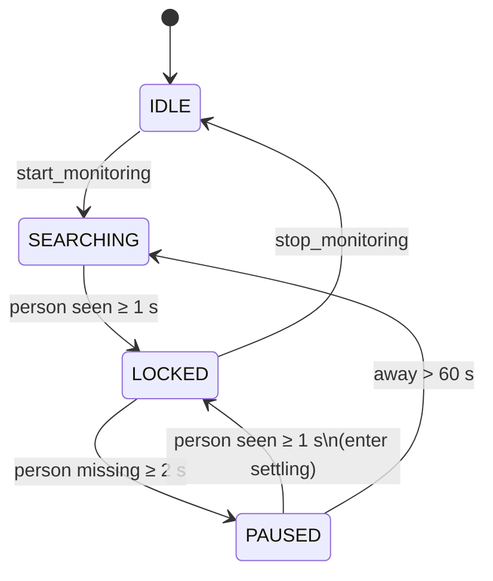

# Architecture

Sentry is a single Python process that talks to a local React UI through a
small HTTP API. There is no daemon, no message broker, and no external
service involvement.

```mermaid
flowchart LR
    Cam[Webcam] --> CameraStream
    CameraStream -- RGB frames --> Detector[PostureDetector\n(MediaPipe)]
    Detector -- per-frame poses --> Tracker[Tracker\n(state machine + identity)]
    Tracker -- alerts --> Notifier[notifications.py]
    Tracker -- snapshot --> API[FastAPI app.state]
    UI[React dashboard] -- /api/status, /api/config --> API
    UI -- /api/feed (debug only) --> API
```

## Modules

| Module | Responsibility |
| ------ | -------------- |
| `sentry.camera` | Threaded reader for webcam or IP-stream URLs; OS-aware backend selection (`CAP_DSHOW`, `CAP_AVFOUNDATION`, `CAP_V4L2`). Includes platform-specific device enumeration with friendly names. |
| `sentry.posture` | Wraps MediaPipe's Pose Landmarker (`num_poses=3`) and computes the CVA from world-space landmarks so it's invariant to distance. |
| `sentry.tracker` | Pure-Python state machine (`IDLE` / `SEARCHING` / `LOCKED` / `PAUSED`), identity-based primary-person selection, rolling-median smoothing, settling window, alert hysteresis. |
| `sentry.api` | FastAPI app + `AppState` dataclass. Routes only mutate state through methods on `AppState`. Production builds also serve the static UI from `ui/dist/`. |
| `sentry.notifications` | Single `notify(title, body)` function that picks `win11toast` on Windows and `notifypy` elsewhere. |
| `sentry.tray` | Pystray icon. Isolated so headless tests can import the rest of the package without it. |
| `sentry.config` | Paths (`SENTRY_HOME`), the model registry, and persisted user settings. |
| `sentry.models_download` | First-run downloader for MediaPipe weights. Streams with progress. |

## Lifecycle

1. `python run.py` ensures dependencies, model files, and a UI bundle.
2. `python -m sentry` boots `create_app()` which kicks off the monitor
   thread and (optionally) the tray.
3. The monitor thread reads frames, calls the detector, then the tracker.
   When `tracker.tick()` sets `should_alert=True`, it calls `notify()`.
4. The UI polls `/api/status` once per second and renders the current
   tracker state.
5. On shutdown the FastAPI lifespan cancels the monitor thread, releases
   the camera, and stops the tray.

## Why CVA from world-space?

Pixel distances change with how close the user sits to the camera. The
craniovertebral angle, computed from MediaPipe's `pose_world_landmarks`
(meters in 3D), only depends on geometry and is therefore stable across
seating positions. See `docs/clinical_research.md`.

## State machine details



The settling window suppresses alerts for 5 seconds after every
`PAUSED → LOCKED` transition. If the absence was longer than
`away_recalibrate_seconds` (default 60 s), the UI also receives a
`welcome_back` flag once and prompts the user to recalibrate.
